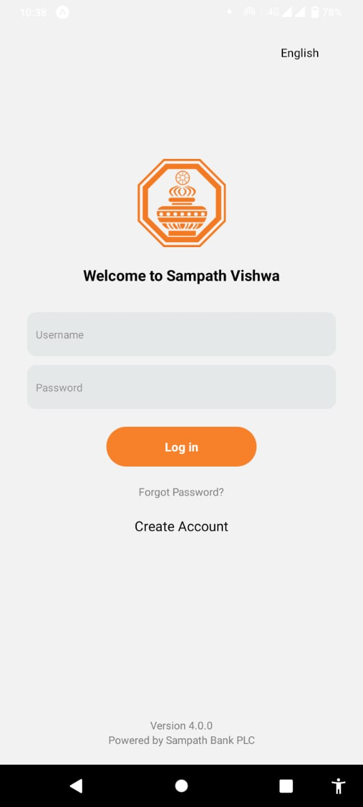
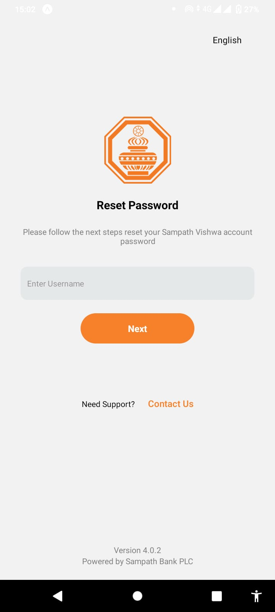

# Sampath Bank Mobile App Clone

## Overview
This project is a clone of the Sampath Bank mobile app, developed using React Native and Expo. The application replicates the primary features and user interface of the official Sampath Bank app, providing a seamless banking experience for users. This project focuses on the UI/UX aspects and does not include backend functionality.

## Features


## Technologies Used
- **React Native:** For building the cross-platform mobile application.
- **Expo:** For a streamlined development process and easy deployment.
- **React Navigation:** For seamless navigation within the app.

## Installation
1. Clone the repository:
   ```bash
   git clone 
   ```
2. Navigate to the project directory:
   ```bash
   cd sampath-bank-app-clone
   ```
3. Install the dependencies:
   ```bash
   npm install
   ```
4. Start the Expo server:
   ```bash
   expo start 
   ```

## Commit History

The development of this project is tracked with commits made page-wise to ensure clarity and organization. Below is a summary of the commits with screenshots for each page:

1. **Loading Screen:**
   - 

2. **Login Screen:**
   - 

3. **Forgot Password Screen:**
   - 